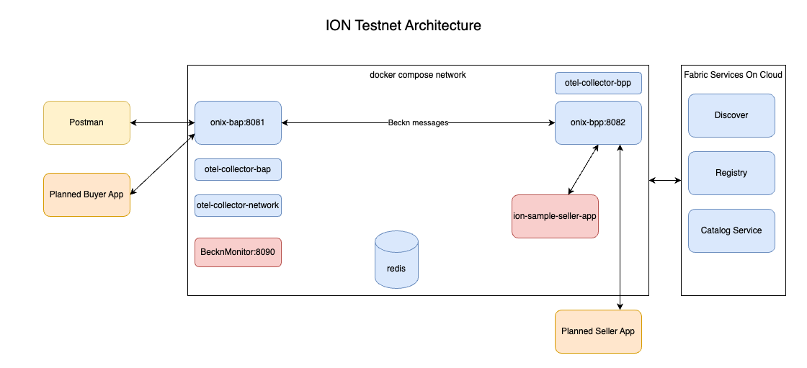

## ION Testnet

Inspired by the [Beckn starter-kit](https://github.com/beckn/starter-kit), the ion Testnet provides a docker compose based all in one development and testing platform for ION (Indonesia Open Network). The primary change from starter-kit is the use of ION registries, ION discover service, ION message format etc.

---

## Table of Contents

- [Overview](#overview)
- [Prerequisites](#prerequisites)
- [Repository Structure](#repository-structure)
- [Quick Start](#quick-start)
- [Importing Postman Collections](#importing-postman-collections)
- [Making API Requests](#making-api-requests)
- [Architecture](#architecture)
- [Troubleshooting](#troubleshooting)

---

## Overview

The ION Testnet enables developers to simulate and test decentralised commerce transactions in different sectors over the beckn protocol. It bundles together a docker compose based network containing the ONIX adapters, simulated seller apps, thin monitoring service for troubleshooting. In addition additional guides and postman collections are provided to help developers quickly build Buyer Apps and Seller Apps.

Testnet can be run in two modes. In the first mode, all the actors run within the local computer and there is no need for a web accessible address. In the second mode, some actors (particularly the discover service) are on the network and so the local computer requires a network accessible endpoint for the discover service to send back the on_discover as well as for discover service to crawl any hosted catalogs. This document describes the latter configuration. It uses the ngrok program to create a web accessible endpoint through which all incoming and outgoing communication are directed. Towards the end of this document a section for the former configuration is added.

---

## Prerequisites

Before you begin, ensure the following tools are installed on your system:

- **Git** — to clone this repository (You should be able to run `git` command at the terminal)
- **Docker Desktop** (You should be able to run `docker compose` command at the terminal)
- **Postman** — to import and run the test collections
  - [Download Postman](https://www.postman.com/downloads/)
- **ngrok client**
    - We need to download the ngrok software onto local machine (You should be able to run `ngrok` in terminal)
    - We need to signup at ngrok.com . 
    - After signup, 
      - click on the `Your AuthToken` menu on the left panel and copy the Auth Token(`NGROK_AUTH_TOKEN`)
      - click on the domains menu item. The center panel will show a web address that is reserved for you(`NGROK_DEV_DOMAIN`). This web address will be used to expose your local computer to the external world.

---

## Repository Structure

```text
testnet/
├── config/          # Configuration files for the adapter
├── postman/         # Postman collections for testing
├── data/            # Will be created at runtime and used by software to store catalogs etc
├── docker-compose-testnet.yml  # docker compose file
├── settings.env     # You set your values here
└── configure.sh     # Run this for values you set to be reflected in various config files.

```

---

## Quick Start

These are the steps in brief. They are detailed below
1. Clone the repository
2. Change values in settings.env and run configure.sh (changes config and postman environment)
3. Start ngrok
4. Start docker compose 
5. Import postman collection and environment. Set environment and run requests.

Follow these steps to get the ION testnet running locally:
### 1. Clone the repository

```bash
git clone https://github.com/indonesiaopennetwork/ion-onix.git
cd ion-onix
```

### 2. Configure your settings
- Add your ngrok auth token and ngrok static domain (dev domain) to the `settings.env` file present in the `testnet` folder.
- Within the devlabs site on ION central, configure the required Beckn keys (for both Buyer App and Seller App). Then copy those values and replace them in the settings.env file.
- Now run `configure.sh` file within the testnet folder. This will configure all the remaining files with the values you copied from devlabs.

### 3. Start NGROK
- Within the `testnet` subfolder run the following command
```bash
ngrok start  --all --config config/ngrok.yml
```

### 4. Start the adapter stack
- Within the `testnet` subfolder run the following command
```bash
docker compose -f docker-compose-testnet.yml up --build
```

This command builds and starts all required services. The first run may take a few minutes to pull and build Docker images.

**4a. Verify the stack is running**

Once the containers are up, verify the services are healthy:

```bash
docker compose -f docker-compose-adapter.yml ps
```

All services should show a `running` or `healthy` status.

---

### 5. Importing Postman Collections and environments

The `postman/` directory contains pre-built collections for testing the ION APIs in various sectors.

**Step 1 — Open Postman**

Launch the Postman desktop application.

**Step 2 — Import the collection**

1. Click **Import** in the top-left corner of the Postman window.
2. Select **File** in the import modal.
3. Navigate to the `postman/` directory in your cloned repository.
4. Select the `IONBuyerAppStarter.postman_collection.json` and `IONSellerAppStarter.postman_collection.json` and click **Open**.

**Step 3 - Import the postman environment**
1. Within postman select import and select the IONStarterKitEnv.postman_environment.json file.
2. **Ensure that select the `ION Starter Kit Env` as your environment** before you run API reqests.

### 5b. Making API Requests

Once the stack is running and the collection is imported:

1. Expand `ION Starter Kit Buyer App` and `ION Starter Kit Seller App` collections in the Postman sidebar to view available requests.
2. Click on a request to open it.
3. Review the request method, URL, and body.
4. Click **Send** to execute the request.
5. The response will appear in the panel below.

The collections are ordered to reflect a typical beckn transaction flow (for example: `discover` → `on_discover` → `select` → `on_select`, and so on). Run them in sequence for an end-to-end test.


## Running with default values.
If you do not have devlabs access yet and want to run the network with default values, that is supported. You just need a subset of the above steps. Here are the steps you need to do.
1. Clone the repository
2. Run configure.sh (changes config and postman environment with default values)
3. Start docker compose 
4. Import postman collection and environment. Set environment and run requests.

Remember that when you do it this way, since your local computer does not have a web accessible point, the following will not be possible.
1. You can send discover call, but on_discover will not arrive back from Discover service
2. You can publish the catalog, but it will not be crawled by Discover service.


## Running with only one end credentials
If you have only a Buyer App profile and want to run the Buyer App under your subscriber details and want to run the Seller app with the default credentials, that is possible. Same is the case if you want to only fill the Seller App profile. All you need to do is follow the same steps as QuickStart. Just replace the values you have and leave the rest to default. Continue with the other steps as normal.


## Architecture

The devkit simulates a beckn-compliant Buyer App (BAP-Beckn Application Platform) and Seller App (BPP-Beckn Provider Platform) ONIX adapter pair locally. Here is a high-level overview of the data flow: (IMAGE WIP)

<!--  -->

---

## Troubleshooting

**Containers fail to start**

Check for port conflicts. Inspect logs with:

```bash
docker compose -f docker-compose-testnet.yml logs
```

**Postman requests return connection errors**

Ensure the Docker stack is running and the `BASE_URL` collection variable points to the correct host and port.

**Images fail to build**

Make sure Docker has sufficient resources allocated (RAM/CPU) and that you have a stable internet connection for pulling base images.

**Stopping the stack**

```bash
docker compose -f docker-compose-testnet.yml down
```

---

## License

This project is part of the Indonesia Open Network ecosystem. Refer to the root repository for license details.

